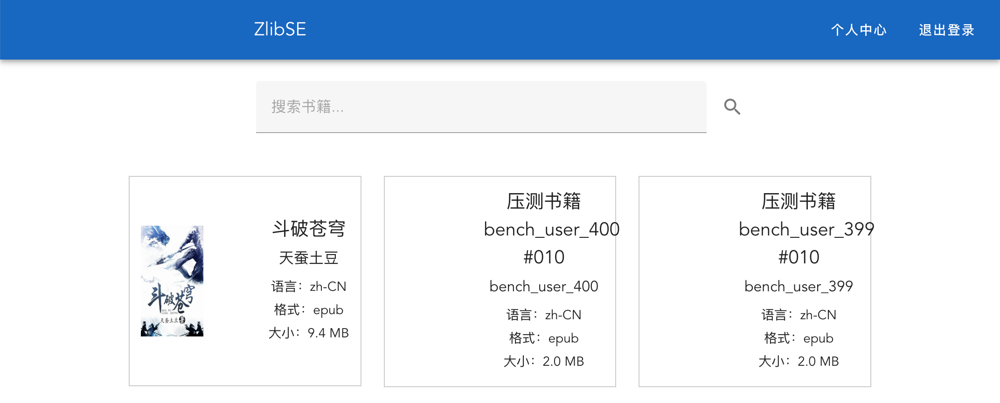
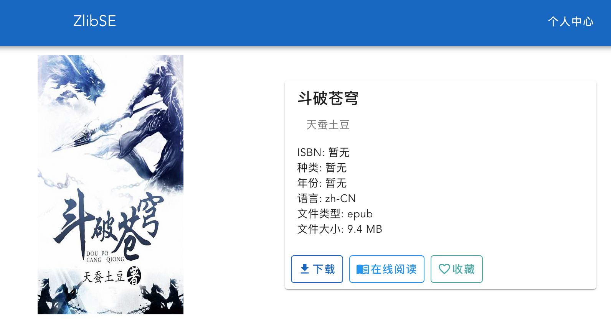

# ZlibSE Frontend

Vue frontend for the ZlibSE project.

## Project Preview





## Development

```bash
npm install
npm run serve
```

## Build

```bash
npm run build
```

## Config

All frontend-related settings are centralized in `src/config/appConfig.json`.

Current settings include:
- backend API base URL
- Vue dev server host
- Vue dev server port
- allowed host names for remote access
- build public path
- build assets directory

## Notes

- This branch keeps frontend code only
- Backend code is maintained on the `main` branch
