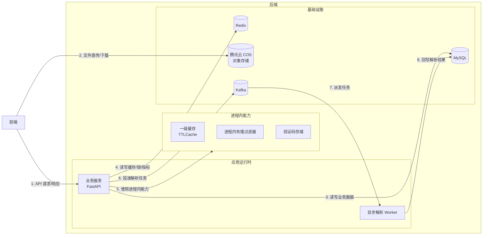

# 整体架构

## 系统整体架构图

## 编号说明

| 编号 | 含义 |
|---|---|
| 1 | 前端通过 HTTP 调用 FastAPI 业务接口，后端返回 JSON 或对象访问地址 |
| 2 | 文件上传和下载使用预签名 URL，前端可直连腾讯云 COS |
| 3 | MySQL 保存用户、书籍、文件、收藏、上传记录和解析结果等业务数据 |
| 4 | Redis 承担共享缓存、认证版本、分布式锁、限流计数和调试指标 |
| 5 | 业务服务使用进程内 TTLCache、布隆过滤器和验证码存储 |
| 6-7 | 上传完成后业务服务把解析任务投递到 Kafka，Worker 异步消费 |
| 8 | Worker 读取 COS 文件完成解析后，把解析结果和文件状态写回 MySQL |

## 边界说明

- `后端` 大框表示当前 FastAPI 后端运行时依赖的核心组件，不表示这些组件都在同一进程内。
- `TTLCache`、`布隆过滤器`、`验证码存储` 是进程内内存；多 worker 时每个 worker 各自持有一份。
- `Redis` 承担共享缓存、认证版本缓存、分布式锁、限流计数、调试指标和部分业务状态集合。
- `MySQL` 是业务数据事实源。
- `腾讯云 COS` 保存上传文件、书籍正文、封面和自动封面。
- `Kafka` 用于文件异步解析任务投递。
