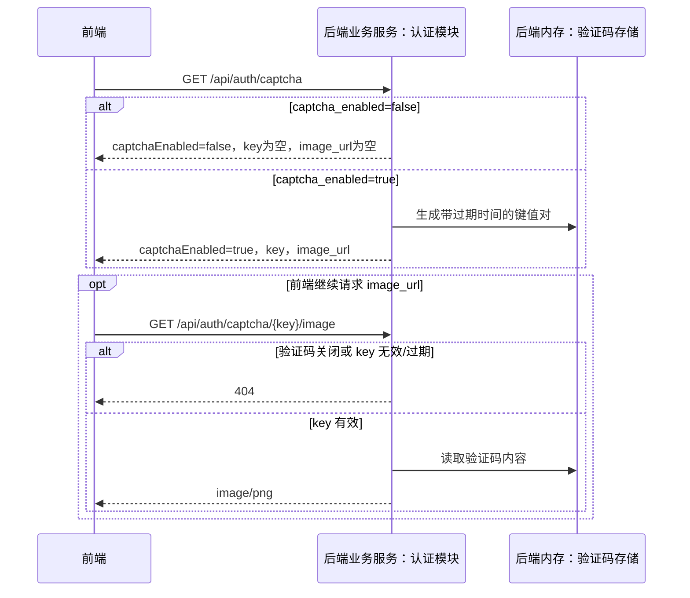
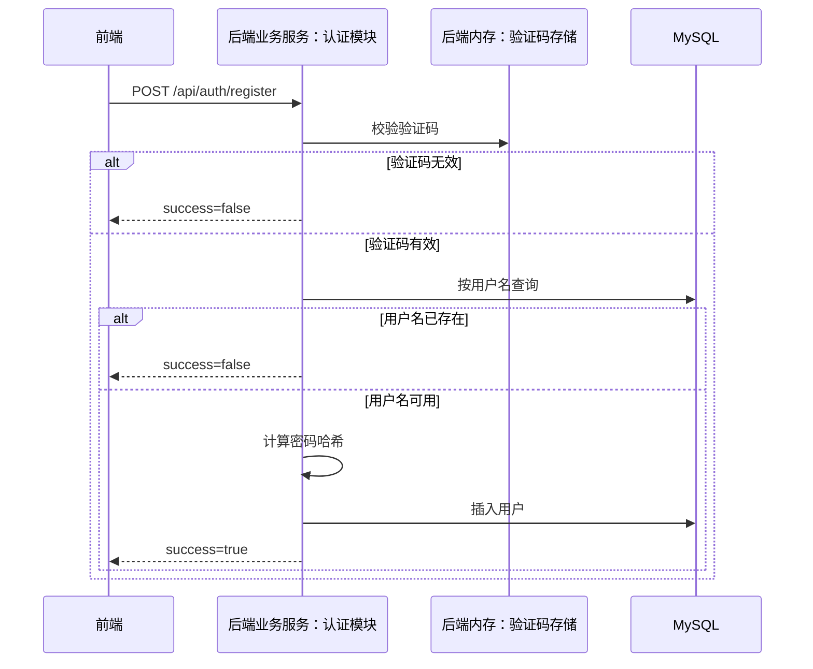
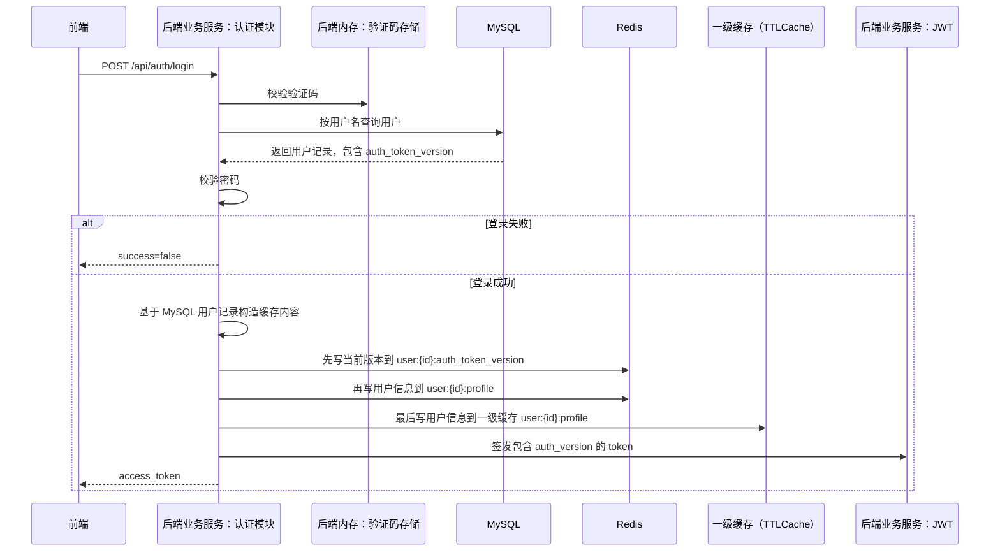
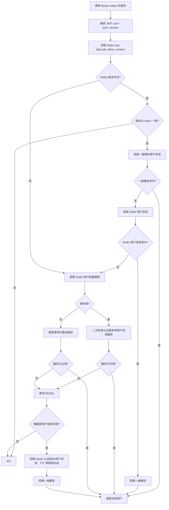
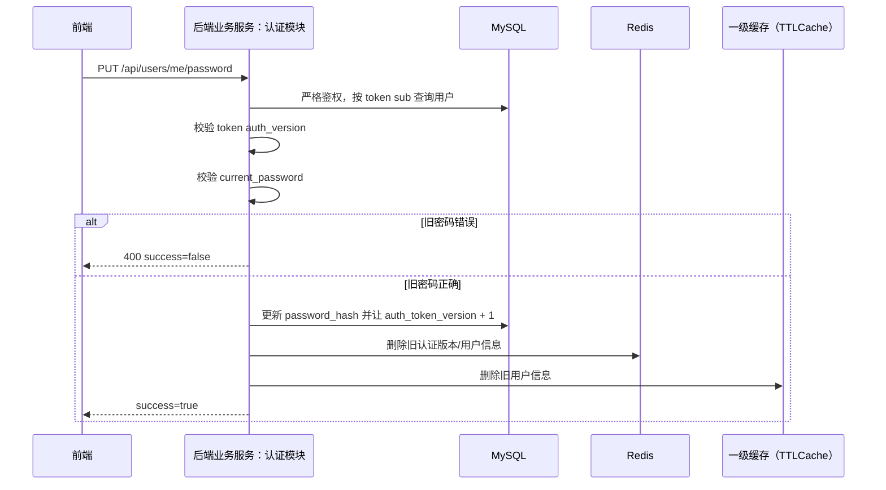

# 认证模块

## 验证码

```mermaid
sequenceDiagram
    participant FE as 前端
    participant API as 后端业务服务：认证模块
    participant Store as 后端内存：验证码存储

    FE->>API: GET /api/auth/captcha

    alt captcha_enabled=false
        API-->>FE: captchaEnabled=false，key为空，image_url为空
    else captcha_enabled=true
        API->>Store: 生成带过期时间的键值对
        API-->>FE: captchaEnabled=true，key，image_url
    end

    opt 前端继续请求 image_url
        FE->>API: GET /api/auth/captcha/{key}/image
        alt 验证码关闭或 key 无效/过期
            API-->>FE: 404
        else key 有效
            API->>Store: 读取验证码内容
            API-->>FE: image/png
        end
    end
```

## 注册

```mermaid
sequenceDiagram
    participant FE as 前端
    participant API as 后端业务服务：认证模块
    participant Captcha as 后端内存：验证码存储
    participant DB as MySQL

    FE->>API: POST /api/auth/register
    API->>Captcha: 校验验证码
    alt 验证码无效
        API-->>FE: success=false
    else 验证码有效
        API->>DB: 按用户名查询
        alt 用户名已存在
            API-->>FE: success=false
        else 用户名可用
            API->>API: 计算密码哈希
            API->>DB: 插入用户
            API-->>FE: success=true
        end
    end
```

## 登录

```mermaid
sequenceDiagram
    participant FE as 前端
    participant API as 后端业务服务：认证模块
    participant Captcha as 后端内存：验证码存储
    participant DB as MySQL
    participant Redis as Redis
    participant L1 as 一级缓存（TTLCache）
    participant JWT as 后端业务服务：JWT

    FE->>API: POST /api/auth/login
    API->>Captcha: 校验验证码
    API->>DB: 按用户名查询用户
    DB-->>API: 返回用户记录，包含 auth_token_version
    API->>API: 校验密码
    alt 登录失败
        API-->>FE: success=false
    else 登录成功
        API->>API: 基于 MySQL 用户记录构造缓存内容
        API->>Redis: 先写当前版本到 user:{id}:auth_token_version
        API->>Redis: 再写用户信息到 user:{id}:profile
        API->>L1: 最后写用户信息到一级缓存 user:{id}:profile
        API->>JWT: 签发包含 auth_version 的 token
        API-->>FE: access_token
    end
```

## /me 默认鉴权

```mermaid
flowchart TD
    A[携带 Bearer token 的请求] --> B[解析 JWT: sub + auth_version]
    B --> C["读取 Redis user:{id}:auth_token_version"]
    C --> D{Redis 版本存在?}
    D -- 是 --> E{版本与 token 一致?}
    E -- 否 --> X[401]
    E -- 是 --> F[读取一级缓存用户信息]
    F --> G{一级缓存命中?}
    G -- 是 --> R[返回当前用户]
    G -- 否 --> H[读取 Redis 用户信息]
    H --> I{Redis 用户信息命中?}
    I -- 是 --> J[回填一级缓存]
    J --> R
    I -- 否 --> K[获取 Redis 用户级重建锁]
    D -- 否 --> K
    K --> K1{拿到锁?}
    K1 -- 是 --> K2[二次检查认证版本和用户信息缓存]
    K2 --> K3{缓存已可用?}
    K3 -- 是 --> R
    K3 -- 否 --> L[查询 MySQL]
    K1 -- 否 --> W[短暂等待并重试缓存]
    W --> W1{缓存已出现?}
    W1 -- 是 --> R
    W1 -- 否 --> L
    L --> M{数据库用户版本匹配?}
    M -- 否 --> X
    M -- 是 --> N[回填 Redis 认证版本/用户信息，TTL 带随机抖动]
    N --> O[回填一级缓存]
    O --> R
```

## 改密

```mermaid
sequenceDiagram
    participant FE as 前端
    participant API as 后端业务服务：认证模块
    participant DB as MySQL
    participant Redis as Redis
    participant L1 as 一级缓存（TTLCache）

    FE->>API: PUT /api/users/me/password
    API->>DB: 严格鉴权，按 token sub 查询用户
    API->>API: 校验 token auth_version
    API->>API: 校验 current_password
    alt 旧密码错误
        API-->>FE: 400 success=false
    else 旧密码正确
        API->>DB: 更新 password_hash 并让 auth_token_version + 1
        API->>Redis: 删除旧认证版本/用户信息
        API->>L1: 删除旧用户信息
        API-->>FE: success=true
    end
```
