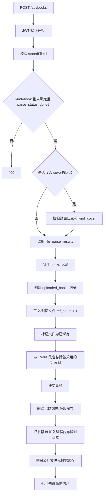
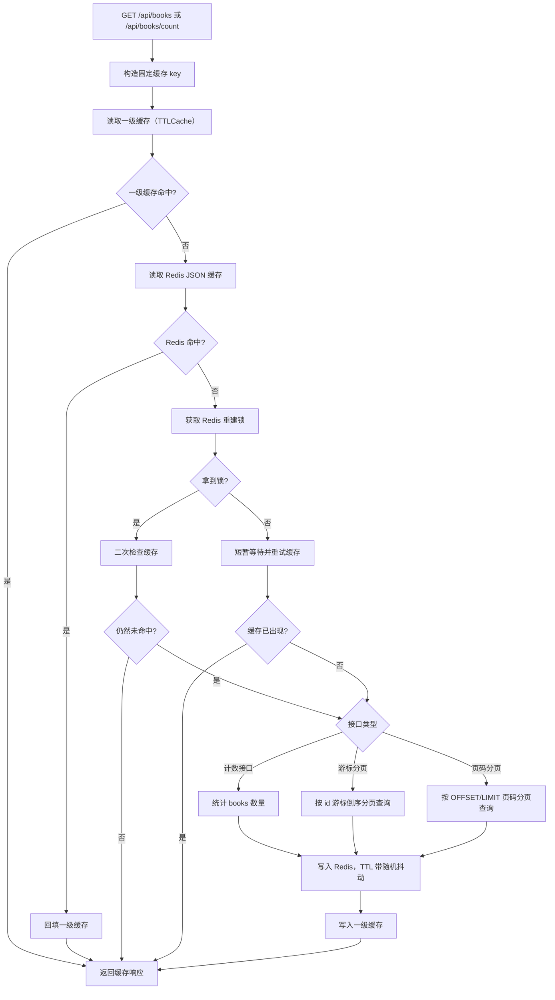
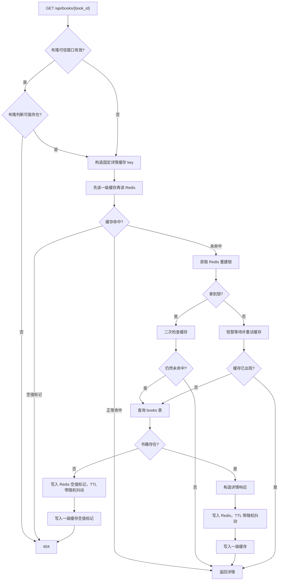
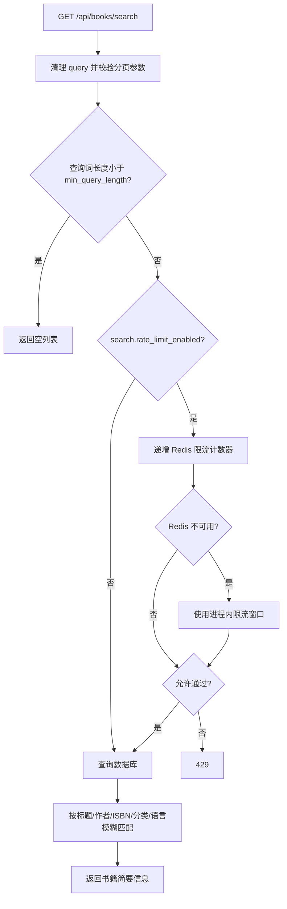

# 书籍模块

## 创建书籍

```mermaid
flowchart TD
    A[POST /api/books] --> B[JWT 默认鉴权]
    B --> C[校验 storedFileId]
    C --> C1{kind=book 且未绑定且 parse_status=done?}
    C1 -- 否 --> X[400]
    C1 -- 是 --> D{是否传入 coverFileId?}
    D -- 是 --> E[校验封面归属和 kind=cover]
    D -- 否 --> F[读取 file_parse_results]
    E --> F
    F --> G[创建 books 记录]
    G --> H[创建 uploaded_books 记录]
    H --> I[正文/封面文件 ref_count + 1]
    I --> J[标记文件为已绑定]
    J --> K[从 Redis 集合移除被采用的封面 id]
    K --> L[提交事务]
    L --> M[删除书籍列表/计数缓存]
    M --> N[把书籍 id 加入进程内布隆过滤器]
    N --> O[删除公开文件元数据缓存]
    O --> P[返回书籍简要信息]
```

## 列表与计数缓存

```mermaid
flowchart TD
    A[GET /api/books 或 /api/books/count] --> C[构造固定缓存 key]
    C --> D[读取一级缓存（TTLCache）]
    D --> E{一级缓存命中?}
    E -- 是 --> R[返回缓存响应]
    E -- 否 --> F[读取 Redis JSON 缓存]
    F --> G{Redis 命中?}
    G -- 是 --> H[回填一级缓存]
    H --> R
    G -- 否 --> I[获取 Redis 重建锁]
    I --> I1{拿到锁?}
    I1 -- 是 --> I2[二次检查缓存]
    I2 --> I3{仍然未命中?}
    I3 -- 否 --> R
    I3 -- 是 --> J{接口类型}
    I1 -- 否 --> W[短暂等待并重试缓存]
    W --> W1{缓存已出现?}
    W1 -- 是 --> R
    W1 -- 否 --> J
    J -- 计数接口 --> K[统计 books 数量]
    J -- 游标分页 --> L[按 id 游标倒序分页查询]
    J -- 页码分页 --> M[按 OFFSET/LIMIT 页码分页查询]
    K --> N[写入 Redis，TTL 带随机抖动]
    L --> N
    M --> N
    N --> O[写入一级缓存]
    O --> R
```

## 详情缓存与布隆过滤器

```mermaid
flowchart TD
    A["GET /api/books/{book_id}"] --> B{布隆可信窗口有效?}
    B -- 是 --> C{布隆判断可能存在?}
    C -- 否 --> X[404]
    C -- 是 --> D[构造固定详情缓存 key]
    B -- 否 --> D
    D --> F[先读一级缓存再读 Redis]
    F --> G{缓存命中?}
    G -- 正常命中 --> R[返回详情]
    G -- 空值标记 --> X
    G -- 未命中 --> H[获取 Redis 重建锁]
    H --> I{拿到锁?}
    I -- 是 --> J[二次检查缓存]
    J --> K{仍然未命中?}
    K -- 否 --> R
    K -- 是 --> L[查询 books 表]
    L --> M{书籍存在?}
    M -- 否 --> N[写入 Redis 空值标记，TTL 带随机抖动]
    N --> N1[写入一级缓存空值标记]
    N1 --> X
    M -- 是 --> O[构造详情响应]
    O --> P[写入 Redis，TTL 带随机抖动]
    P --> P1[写入一级缓存]
    P1 --> R
    I -- 否 --> Q[短暂等待并重试缓存]
    Q --> S{缓存已出现?}
    S -- 是 --> R
    S -- 否 --> L
```

## 搜索

```mermaid
flowchart TD
    A[GET /api/books/search] --> B[清理 query 并校验分页参数]
    B --> C{查询词长度小于 min_query_length?}
    C -- 是 --> R0[返回空列表]
    C -- 否 --> D{search.rate_limit_enabled?}
    D -- 否 --> H[查询数据库]
    D -- 是 --> E[递增 Redis 限流计数器]
    E --> F{Redis 不可用?}
    F -- 是 --> G[使用进程内限流窗口]
    F -- 否 --> I{允许通过?}
    G --> I
    I -- 否 --> X[429]
    I -- 是 --> H
    H --> J[按标题/作者/ISBN/分类/语言模糊匹配]
    J --> R[返回书籍简要信息]
```
