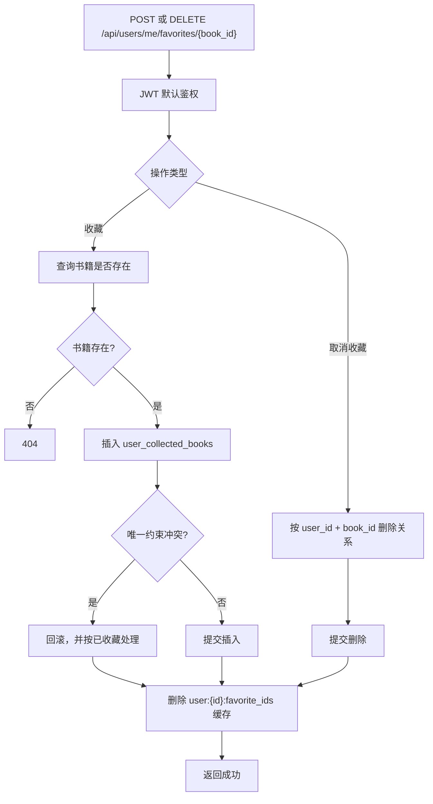
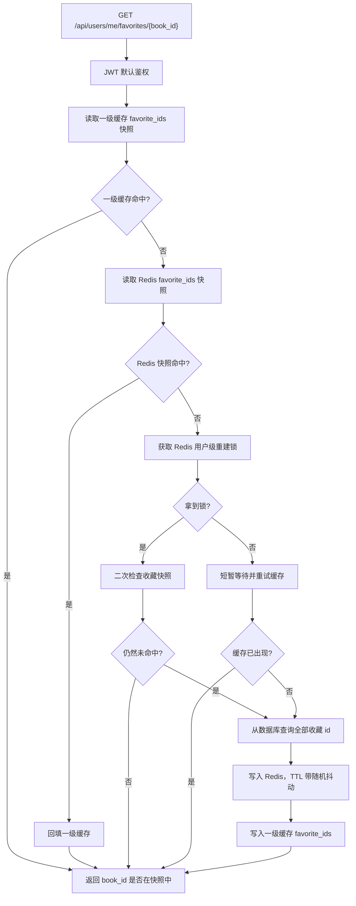
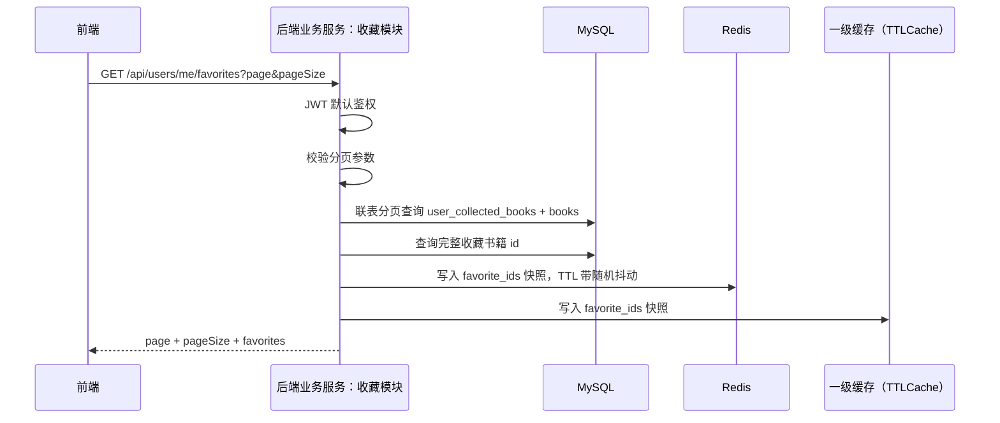

# 收藏模块

## 增删收藏

```mermaid
flowchart TD
    A["POST 或 DELETE /api/users/me/favorites/{book_id}"] --> B[JWT 默认鉴权]
    B --> C{操作类型}
    C -- 收藏 --> D[查询书籍是否存在]
    D --> E{书籍存在?}
    E -- 否 --> X[404]
    E -- 是 --> F[插入 user_collected_books]
    F --> G{唯一约束冲突?}
    G -- 是 --> H[回滚，并按已收藏处理]
    G -- 否 --> I[提交插入]
    H --> J["删除 user:{id}:favorite_ids 缓存"]
    I --> J
    C -- 取消收藏 --> K[按 user_id + book_id 删除关系]
    K --> L[提交删除]
    L --> J
    J --> R[返回成功]
```

## 收藏状态缓存

```mermaid
flowchart TD
    A["GET /api/users/me/favorites/{book_id}"] --> B[JWT 默认鉴权]
    B --> E[读取一级缓存 favorite_ids 快照]
    E --> F{一级缓存命中?}
    F -- 是 --> R[返回 book_id 是否在快照中]
    F -- 否 --> G[读取 Redis favorite_ids 快照]
    G --> I{Redis 快照命中?}
    I -- 是 --> J[回填一级缓存]
    J --> R
    I -- 否 --> H[获取 Redis 用户级重建锁]
    H --> H1{拿到锁?}
    H1 -- 是 --> H2[二次检查收藏快照]
    H2 --> H3{仍然未命中?}
    H3 -- 否 --> R
    H3 -- 是 --> K[从数据库查询全部收藏 id]
    H1 -- 否 --> W[短暂等待并重试缓存]
    W --> W1{缓存已出现?}
    W1 -- 是 --> R
    W1 -- 否 --> K
    K --> L[写入 Redis，TTL 带随机抖动]
    L --> M[写入一级缓存 favorite_ids]
    M --> R
```

## 收藏列表

```mermaid
sequenceDiagram
    participant FE as 前端
    participant API as 后端业务服务：收藏模块
    participant DB as MySQL
    participant Redis as Redis
    participant L1 as 一级缓存（TTLCache）

    FE->>API: GET /api/users/me/favorites?page&pageSize
    API->>API: JWT 默认鉴权
    API->>API: 校验分页参数
    API->>DB: 联表分页查询 user_collected_books + books
    API->>DB: 查询完整收藏书籍 id
    API->>Redis: 写入 favorite_ids 快照，TTL 带随机抖动
    API->>L1: 写入 favorite_ids 快照
    API-->>FE: page + pageSize + favorites
```
