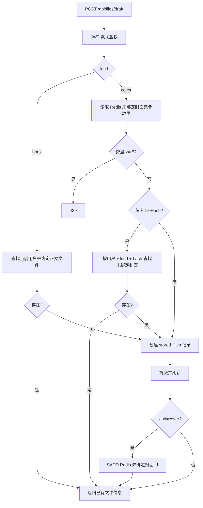
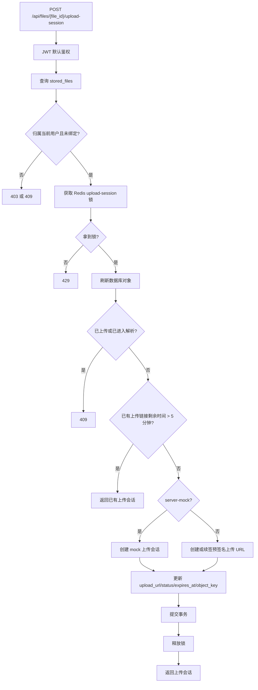
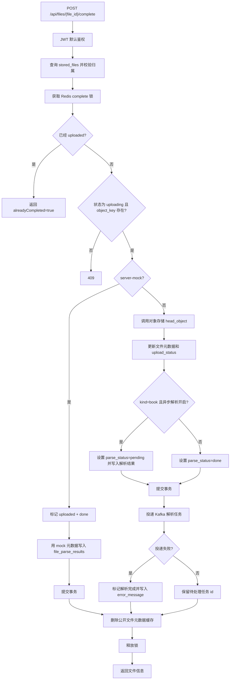
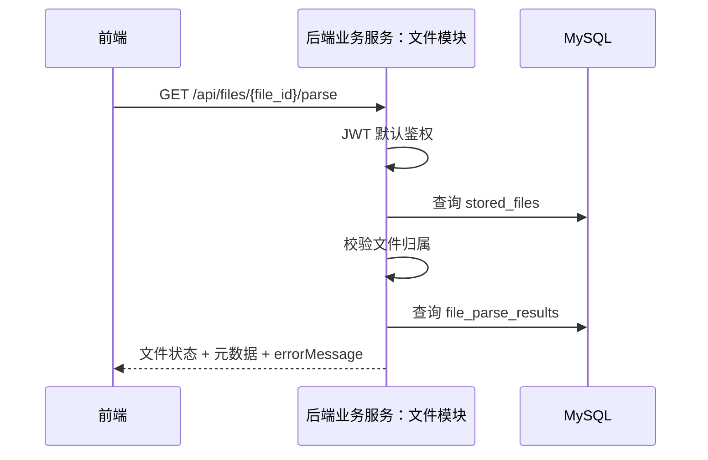
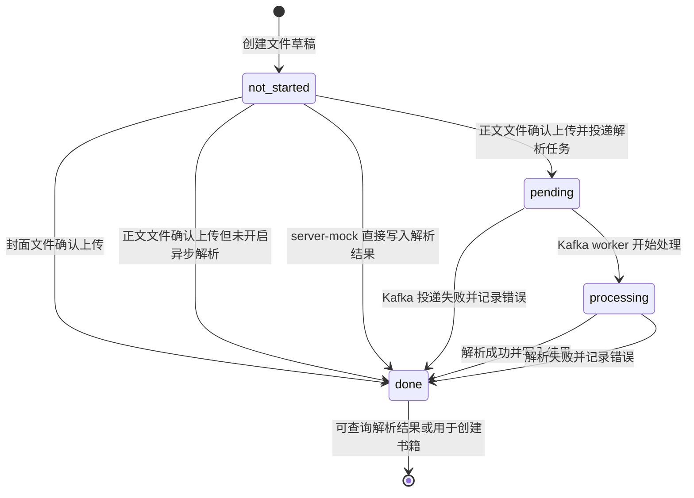
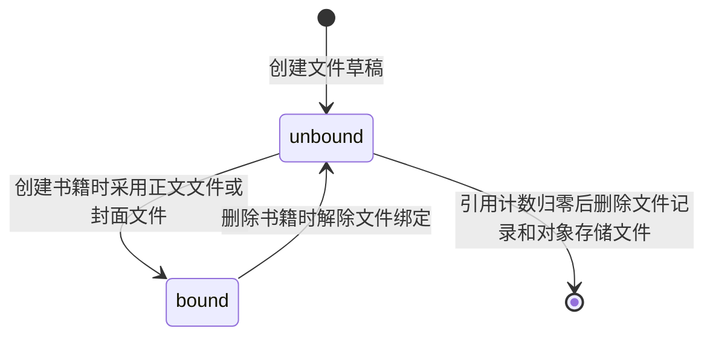
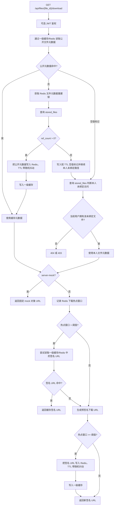

# 文件模块

## 创建文件草稿

## 申请上传会话

## 确认上传完成

## 查询解析结果

## parse_status 状态机

说明：

- `not_started`：文件草稿刚创建，还没有完成上传。
- `pending`：正文文件已上传，解析任务已准备进入 Kafka。
- `processing`：异步解析 worker 已取到任务并开始解析。
- `done`：解析链路结束。成功时写入元数据；失败时写入 `error_message`；封面文件和未开启异步解析的文件也会直接进入该状态。

## bind_status 状态机

说明：

- `unbound`：文件还没有被书籍使用，可以申请上传会话；未绑定封面会被加入 Redis Set 做数量控制。
- `bound`：文件已被书籍引用，不能再申请上传会话；作为正文或封面参与书籍详情和下载。
- 删除书籍时会先把关联文件标回 `unbound` 并递减引用计数；如果引用计数归零，会删除对象存储文件和 `stored_files` 记录。

## 获取下载地址

下载接口返回的是 `downloadUrl / expiresIn / filename`。浏览器随后直接请求 `downloadUrl` 对应的 COS 预签名地址获取文件，后端只负责访问控制和签名生成，不转发文件内容。
