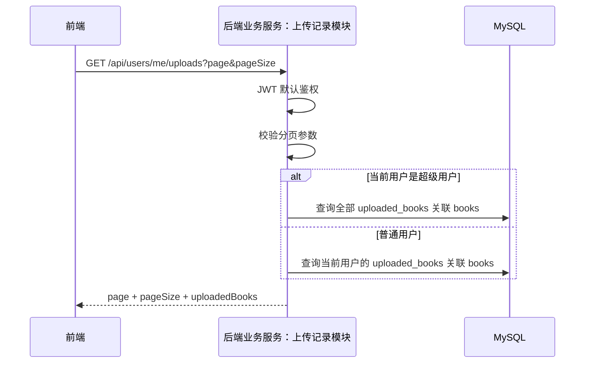
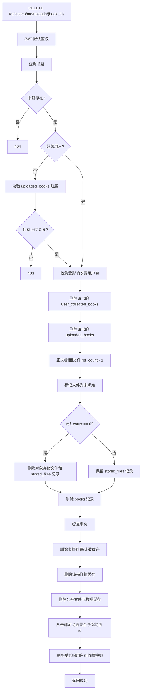

# 上传记录模块

## 上传列表

```mermaid
sequenceDiagram
    participant FE as 前端
    participant API as 后端业务服务：上传记录模块
    participant DB as MySQL

    FE->>API: GET /api/users/me/uploads?page&pageSize
    API->>API: JWT 默认鉴权
    API->>API: 校验分页参数
    alt 当前用户是超级用户
        API->>DB: 查询全部 uploaded_books 关联 books
    else 普通用户
        API->>DB: 查询当前用户的 uploaded_books 关联 books
    end
    API-->>FE: page + pageSize + uploadedBooks
```

## 删除书籍及文件

```mermaid
flowchart TD
    A["DELETE /api/users/me/uploads/{book_id}"] --> B[JWT 默认鉴权]
    B --> C[查询书籍]
    C --> D{书籍存在?}
    D -- 否 --> X[404]
    D -- 是 --> E{超级用户?}
    E -- 否 --> F[校验 uploaded_books 归属]
    F --> G{拥有上传关系?}
    G -- 否 --> Y[403]
    G -- 是 --> H[收集受影响收藏用户 id]
    E -- 是 --> H
    H --> I[删除该书的 user_collected_books]
    I --> J[删除该书的 uploaded_books]
    J --> K[正文/封面文件 ref_count - 1]
    K --> L[标记文件为未绑定]
    L --> M{ref_count == 0?}
    M -- 是 --> N[删除对象存储文件和 stored_files 记录]
    M -- 否 --> O[保留 stored_files 记录]
    N --> P[删除 books 记录]
    O --> P
    P --> Q[提交事务]
    Q --> R[删除书籍列表/计数缓存]
    R --> S[删除该书详情缓存]
    S --> T[删除公开文件元数据缓存]
    T --> U[从未绑定封面集合移除封面 id]
    U --> V[删除受影响用户的收藏快照]
    V --> W[返回成功]
```
