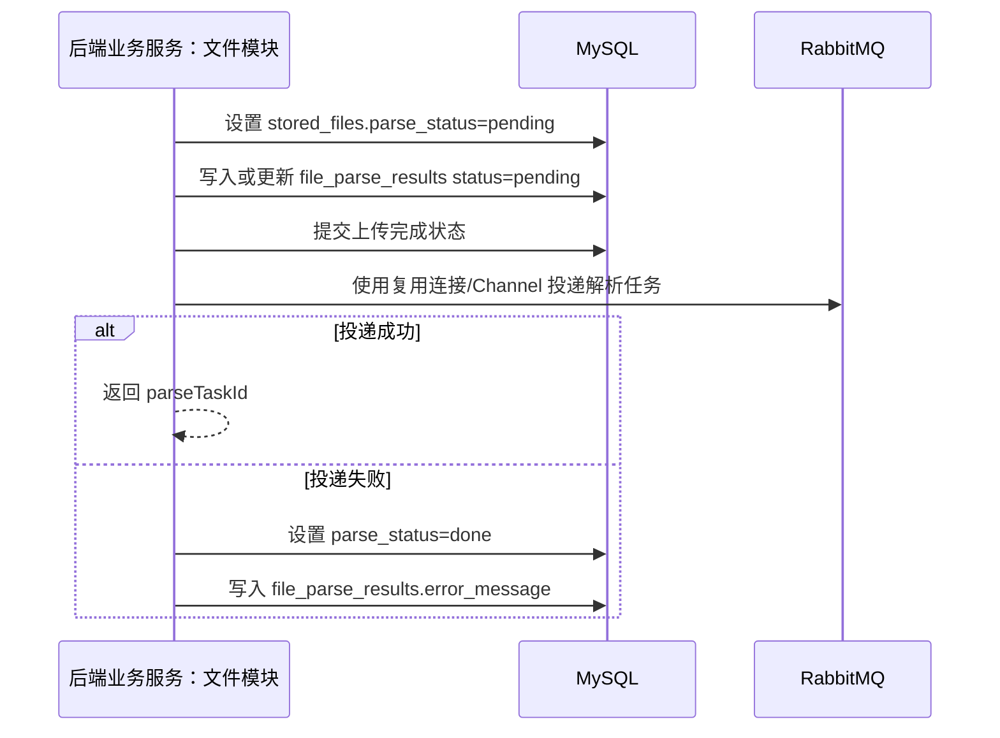
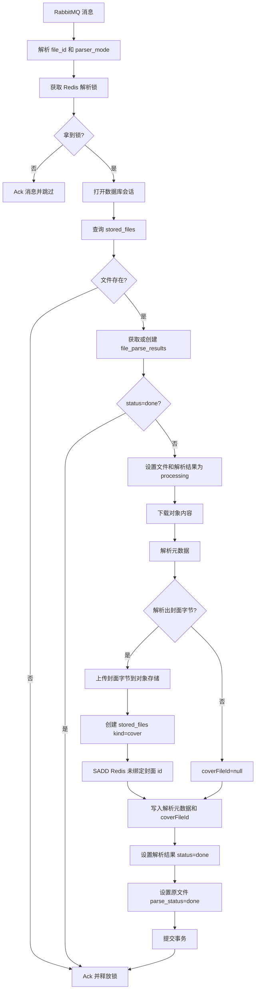
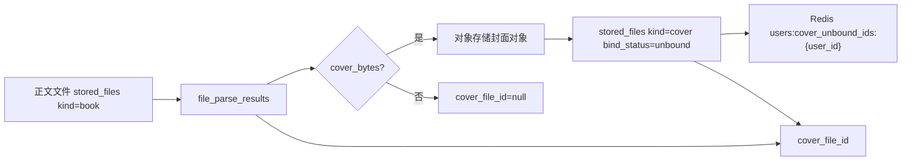

# 异步解析模块

## 上传完成到 RabbitMQ

```mermaid
sequenceDiagram
    participant API as 后端业务服务：文件模块
    participant DB as MySQL
    participant MQ as RabbitMQ

    API->>DB: 设置 stored_files.parse_status=pending
    API->>DB: 写入或更新 file_parse_results status=pending
    API->>DB: 提交上传完成状态
    API->>MQ: 使用复用连接/Channel 投递解析任务
    alt 投递成功
        API-->>API: 返回 parseTaskId
    else 投递失败
        API->>DB: 设置 parse_status=done
        API->>DB: 写入 file_parse_results.error_message
    end
```

## 解析工作进程流程

```mermaid
flowchart TD
    A[RabbitMQ 消息] --> B[解析 file_id 和 parser_mode]
    B --> C[获取 Redis 解析锁]
    C --> D{拿到锁?}
    D -- 否 --> E[Ack 消息并跳过]
    D -- 是 --> F[打开数据库会话]
    F --> G[查询 stored_files]
    G --> H{文件存在?}
    H -- 否 --> I[Ack 并释放锁]
    H -- 是 --> J[获取或创建 file_parse_results]
    J --> K{status=done?}
    K -- 是 --> I
    K -- 否 --> L[设置文件和解析结果为 processing]
    L --> M[下载对象内容]
    M --> N[解析元数据]
    N --> O{解析出封面字节?}
    O -- 是 --> P[上传封面字节到对象存储]
    P --> Q[创建 stored_files kind=cover]
    Q --> R[SADD Redis 未绑定封面 id]
    O -- 否 --> S[coverFileId=null]
    R --> T[写入解析元数据和 coverFileId]
    S --> T
    T --> U[设置解析结果 status=done]
    U --> V[设置原文件 parse_status=done]
    V --> W[提交事务]
    W --> I
```

## 自动封面产物关系

```mermaid
flowchart LR
    A[正文文件 stored_files kind=book] --> B[file_parse_results]
    B --> C{cover_bytes?}
    C -- 是 --> D[对象存储封面对象]
    D --> E[stored_files kind=cover bind_status=unbound]
    E --> F["Redis users:cover_unbound_ids:{user_id}"]
    B --> G[cover_file_id]
    E --> G
    C -- 否 --> H[cover_file_id=null]
```
