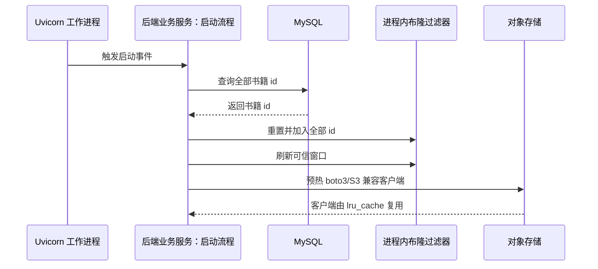
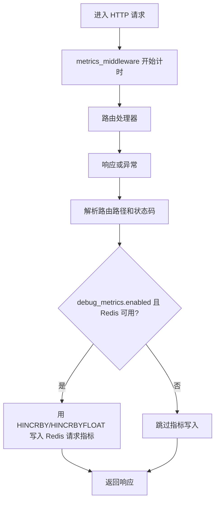
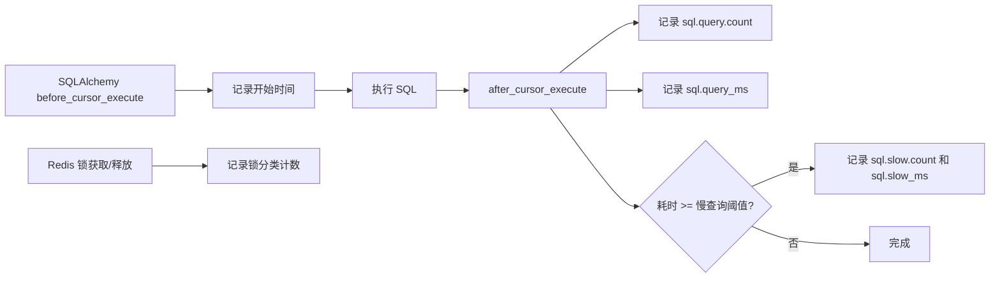

# 启动与基础设施

## 应用启动

```mermaid
sequenceDiagram
    participant Uvicorn as Uvicorn 工作进程
    participant App as 后端业务服务：启动流程
    participant DB as MySQL
    participant Bloom as 进程内布隆过滤器
    participant Storage as 对象存储

    Uvicorn->>App: 触发启动事件
    App->>DB: 查询全部书籍 id
    DB-->>App: 返回书籍 id
    App->>Bloom: 重置并加入全部 id
    App->>Bloom: 刷新可信窗口
    App->>Storage: 预热 boto3/S3 兼容客户端
    Storage-->>App: 客户端由 lru_cache 复用
```

## 指标中间件

```mermaid
flowchart TD
    A[进入 HTTP 请求] --> B[metrics_middleware 开始计时]
    B --> C[路由处理器]
    C --> D[响应或异常]
    D --> E[解析路由路径和状态码]
    E --> F{debug_metrics.enabled 且 Redis 可用?}
    F -- 是 --> G[用 HINCRBY/HINCRBYFLOAT 写入 Redis 请求指标]
    F -- 否 --> H[跳过指标写入]
    G --> I[返回响应]
    H --> I
```

## SQL 与锁指标

```mermaid
flowchart LR
    A[SQLAlchemy before_cursor_execute] --> B[记录开始时间]
    B --> C[执行 SQL]
    C --> D[after_cursor_execute]
    D --> E[记录 sql.query.count]
    D --> F[记录 sql.query_ms]
    D --> G{耗时 >= 慢查询阈值?}
    G -- 是 --> H[记录 sql.slow.count 和 sql.slow_ms]
    G -- 否 --> I[完成]

    J[Redis 锁获取/释放] --> K[记录锁分类计数]
```
