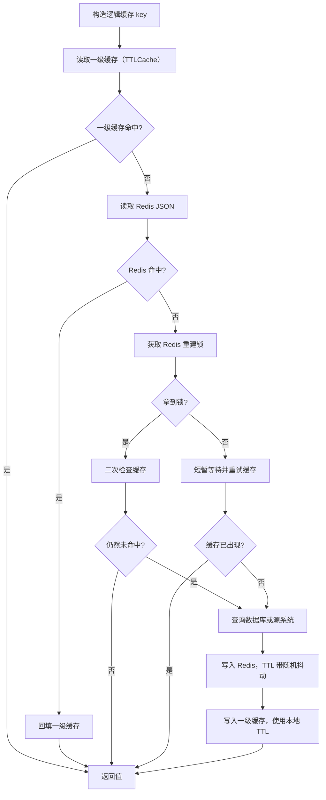
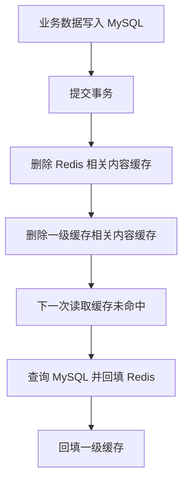
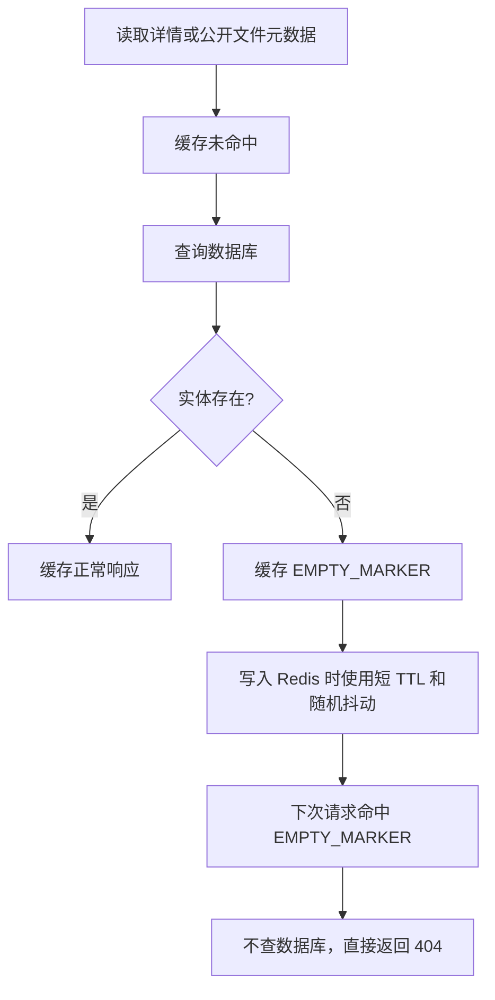
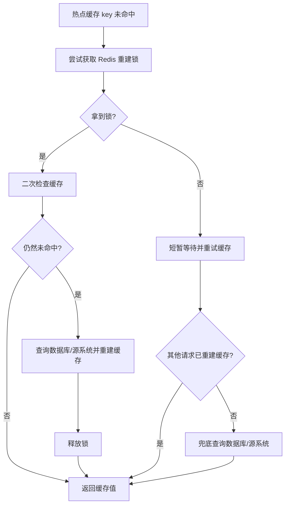
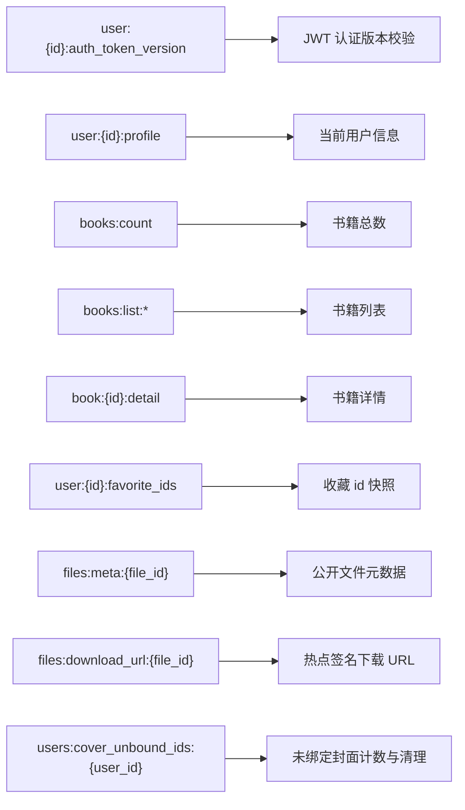

# 缓存体系总览

## 混合缓存读写

```mermaid
flowchart TD
    A[构造逻辑缓存 key] --> B[读取一级缓存（TTLCache）]
    B --> C{一级缓存命中?}
    C -- 是 --> R[返回值]
    C -- 否 --> D[读取 Redis JSON]
    D --> E{Redis 命中?}
    E -- 是 --> F[回填一级缓存]
    F --> R
    E -- 否 --> G[获取 Redis 重建锁]
    G --> H{拿到锁?}
    H -- 是 --> I[二次检查缓存]
    I --> J{仍然未命中?}
    J -- 否 --> R
    J -- 是 --> K[查询数据库或源系统]
    H -- 否 --> L[短暂等待并重试缓存]
    L --> M{缓存已出现?}
    M -- 是 --> R
    M -- 否 --> K
    K --> N[写入 Redis，TTL 带随机抖动]
    N --> O[写入一级缓存，使用本地 TTL]
    O --> R
```

## 写后删除缓存

```mermaid
flowchart TD
    A[业务数据写入 MySQL] --> B[提交事务]
    B --> C[删除 Redis 相关内容缓存]
    C --> D[删除一级缓存相关内容缓存]
    D --> E[下一次读取缓存未命中]
    E --> F[查询 MySQL 并回填 Redis]
    F --> G[回填一级缓存]
```

## 空值缓存

```mermaid
flowchart TD
    A[读取详情或公开文件元数据] --> B[缓存未命中]
    B --> C[查询数据库]
    C --> D{实体存在?}
    D -- 是 --> E[缓存正常响应]
    D -- 否 --> F[缓存 EMPTY_MARKER]
    F --> G[写入 Redis 时使用短 TTL 和随机抖动]
    G --> H[下次请求命中 EMPTY_MARKER]
    H --> I[不查数据库，直接返回 404]
```

## Redis 锁防击穿

```mermaid
flowchart TD
    A[热点缓存 key 未命中] --> B[尝试获取 Redis 重建锁]
    B --> C{拿到锁?}
    C -- 是 --> D[二次检查缓存]
    D --> E{仍然未命中?}
    E -- 是 --> F[查询数据库/源系统并重建缓存]
    E -- 否 --> R[返回缓存值]
    F --> G[释放锁]
    G --> R
    C -- 否 --> H[短暂等待并重试缓存]
    H --> I{其他请求已重建缓存?}
    I -- 是 --> R
    I -- 否 --> J[兜底查询数据库/源系统]
    J --> R
```

## 主要缓存 key

```mermaid
flowchart LR
    A["user:{id}:auth_token_version"] --> B[JWT 认证版本校验]
    C["user:{id}:profile"] --> D[当前用户信息]
    E["books:count"] --> F[书籍总数]
    G["books:list:*"] --> H[书籍列表]
    I["book:{id}:detail"] --> J[书籍详情]
    K["user:{id}:favorite_ids"] --> L[收藏 id 快照]
    M["files:meta:{file_id}"] --> N[公开文件元数据]
    O["files:download_url:{file_id}"] --> P[热点签名下载 URL]
    Q["users:cover_unbound_ids:{user_id}"] --> R[未绑定封面计数与清理]
```
